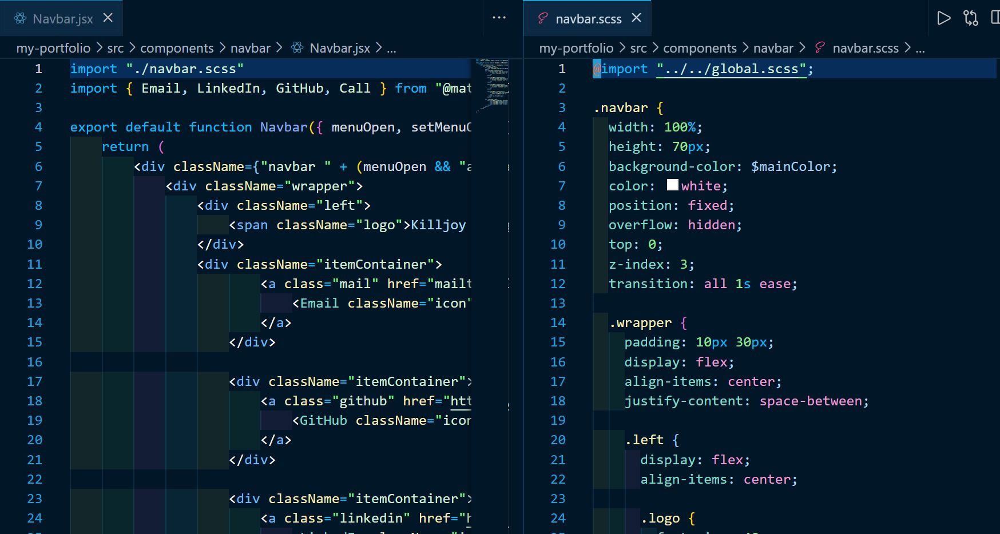
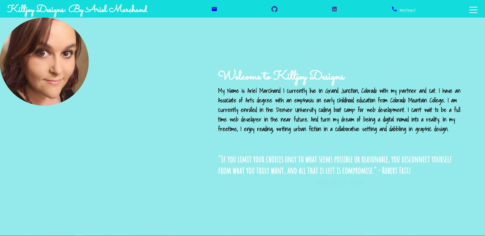

# React-Portfolio

## Introduction:

For this assignment, my task was to create a portfolio using my React skills.

I created a demo app that you can use on this link:
[React Portfolio](https://youthful-tereshkova-4a8af4.netlify.app/)

 
 

## Technologies used:

    * @material-ui/core
    * @material-ui/icons
    * @testing-library/jest-dom
    * @testing-library/react
    * @testing-library/user-event
    * gh-pages
    * node-sass
    * react
    * react-dom
    * react-scripts
    * sass
    * web-vitals

 
 

### Screenshots of Components Folder: Contact

 
 

### Screenshots of Components Folder: Intro

 
 

### Screenshots of Components Folder: Menu

 
 

### Screenshots of Components Folder: Navbar

 
 

### Screenshots of Components Folder: Portfolio

 
 

### Screenshots of SRC Folder code

 
 

### Finished App Main page screenshot

 
 

### Finished App Main page menu screenshot

 
 

### Finished App Portfolio page screenshot

 
 

### Finished App contact page screenshot

